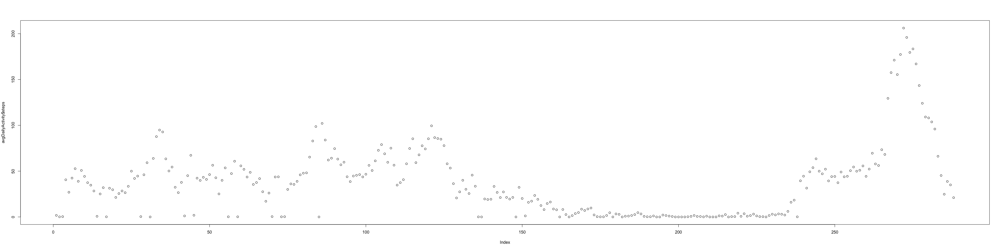

# Reproducible Research: Peer Assessment 1


## Loading and preprocessing the data

First, we'll read the data from CSV and aggregate the steps on a daily basis into a new
data frame in order to make finding daily patterns easier.


```r
activity <- read.csv("activity.csv", colClasses=c('numeric', 'factor', 'factor'))
summary(activity)
```

```
##      steps                date          interval    
##  Min.   :  0.00   2012-10-01:  288   0      :   61  
##  1st Qu.:  0.00   2012-10-02:  288   10     :   61  
##  Median :  0.00   2012-10-03:  288   100    :   61  
##  Mean   : 37.38   2012-10-04:  288   1000   :   61  
##  3rd Qu.: 12.00   2012-10-05:  288   1005   :   61  
##  Max.   :806.00   2012-10-06:  288   1010   :   61  
##  NA's   :2304     (Other)   :15840   (Other):17202
```


## What is mean total number of steps taken per day?

The mean total steps per day is. Keeping the days with missing values:

```r
dailyActivity <- aggregate(
  activity$steps, 
  by=list(date=activity$date), 
  FUN=sum,
  na.rm = TRUE
)
names(dailyActivity) <- c("date", "steps")
mean(dailyActivity$steps)
```

```
## [1] 9354.23
```

The median number of steps per day is:


```r
median(dailyActivity$steps)
```

```
## [1] 10395
```


The distribution of total steps per day looks like:

```r
with(dailyActivity, hist(steps))
```

<!-- -->

## What is the average daily activity pattern?

I will aggregate the number of steps into a mean for each interval. Then will graph the steps vs the interval to show an average daily pattern.


```r
avgDailyActivity <- aggregate(
  activity$steps,
  by=list(interval=activity$interval), 
  FUN=mean,
  na.rm = TRUE
)
summary(avgDailyActivity)
```

```
##     interval         x          
##  0      :  1   Min.   :  0.000  
##  10     :  1   1st Qu.:  2.486  
##  100    :  1   Median : 34.113  
##  1000   :  1   Mean   : 37.383  
##  1005   :  1   3rd Qu.: 52.835  
##  1010   :  1   Max.   :206.170  
##  (Other):282
```

```r
names(avgDailyActivity) <- c("interval", "steps")
plot(avgDailyActivity$steps)
```

<!-- -->

The maximum average number of steps taken per interval is:


```r
avgDailyActivity[which.max(avgDailyActivity$steps),]
```

```
##     interval    steps
## 272      835 206.1698
```

## Imputing missing values
replacing the missing values using average step counts for corresponding intervals calculated by ignoring missing values previously:


```r
naSteps <- is.na(activity$steps)
activity$steps[naSteps] <- avgDailyActivity$steps[match(activity$interval[naSteps], avgDailyActivity$interval)] 
summary(activity)
```

```
##      steps                date          interval    
##  Min.   :  0.00   2012-10-01:  288   0      :   61  
##  1st Qu.:  0.00   2012-10-02:  288   10     :   61  
##  Median :  0.00   2012-10-03:  288   100    :   61  
##  Mean   : 37.38   2012-10-04:  288   1000   :   61  
##  3rd Qu.: 27.00   2012-10-05:  288   1005   :   61  
##  Max.   :806.00   2012-10-06:  288   1010   :   61  
##                   (Other)   :15840   (Other):17202
```

## Are there differences in activity patterns between weekdays and weekends?

First computing day of week for each row.

```r
activity$day <- weekdays(as.Date(as.character(activity$date)))
```
Now aggregating steps based on each weekday and interval pair.


```r
weekdaysActivity <- aggregate(
  activity$steps, 
  by=list(interval=activity$interval, day=activity$day), 
  FUN=mean,
  na.rm = TRUE
)
names(weekdaysActivity) <- c("interval", "day", "steps")
summary(weekdaysActivity)
```

```
##     interval        day                steps       
##  0      :   7   Length:2016        Min.   :  0.00  
##  10     :   7   Class :character   1st Qu.:  1.00  
##  100    :   7   Mode  :character   Median : 15.93  
##  1000   :   7                      Mean   : 37.54  
##  1005   :   7                      3rd Qu.: 56.16  
##  1010   :   7                      Max.   :296.31  
##  (Other):1974
```

Divide the data into weekday and weekends then aggregate the number of steps by averaging for eac interval.


```r
weekends <- 
  subset(
    weekdaysActivity, 
    day == "Sunday" | day == "Saturday"
  )

weekdays<- 
  subset(
    weekdaysActivity, 
    day != "Sunday" & day != "Saturday"
  )


weekdaysAgg <- aggregate(
  weekdays$steps, 
  by=list(interval=weekdays$interval), 
  FUN=mean,
  na.rm = TRUE
)

weekendsAgg <- aggregate(
  weekends$steps, 
  by=list(interval=weekends$interval), 
  FUN=mean,
  na.rm = TRUE
)
```

A quick look makes it visible that people are less active in the morning during weekends and more active during late hours. 


```r
plot(weekdaysAgg$x, xlab = "Weekday intervals", ylab = "Steps")
```

<!-- -->

```r
plot(weekendsAgg$x, xlab = "Weekend intervals", ylab = "Steps")
```

<!-- -->
